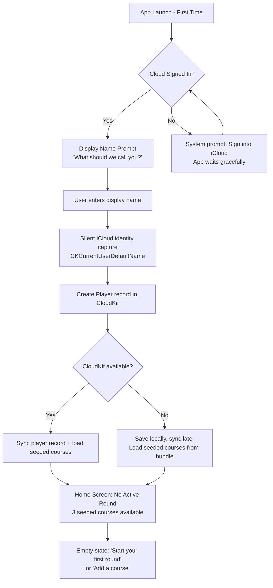
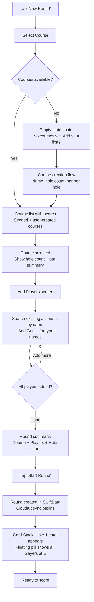
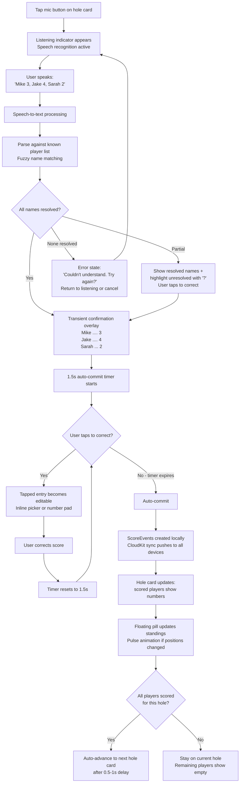
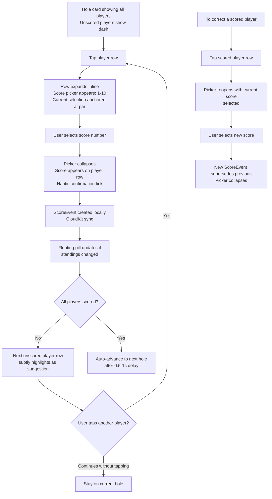
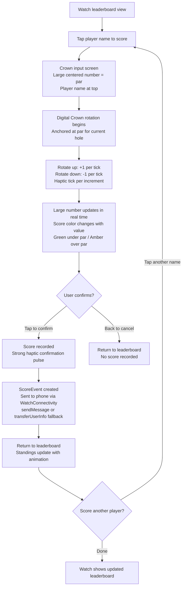
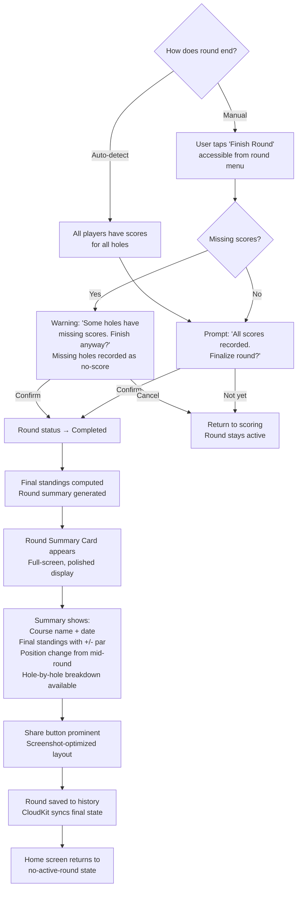
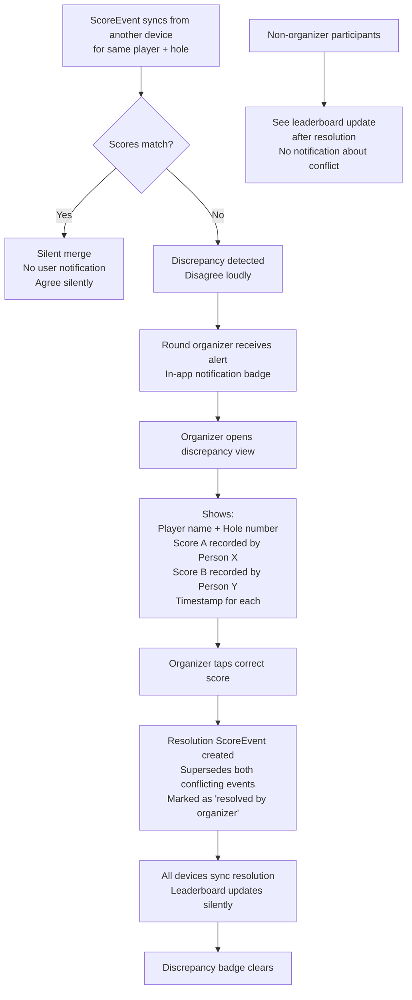
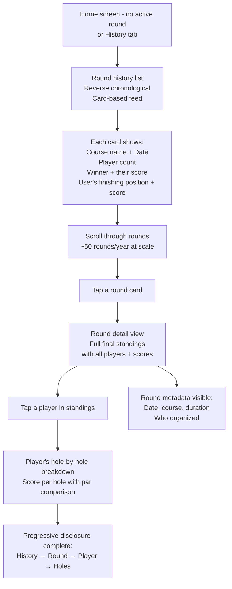

# UX Design Specification hyzer-app

**Author:** shotcowboystyle
**Date:** 2026-02-24

---

## Executive Summary

### Project Vision

Hyzer is a native iOS and Apple Watch disc golf scorecard built for a friend group of 6, designed around one principle: **score without stopping.** Three input paradigms -- voice, Digital Crown, and tap -- each optimized for a different physical moment during a round. Any participant can score for anyone, eliminating the designated scorekeeper burden. A purpose-built Watch companion puts live standings on the wrist. Momentum-driven animations make every leaderboard shift feel like the competitive moment it is.

The app runs on CloudKit's free tier with zero infrastructure cost, distributed via TestFlight. It is also an intentional engineering and design playground for exploring Apple-native development, offline-first sync, rich motion design, and novel interaction patterns.

### Target Users

**Primary persona: "Nate"** -- representing all 6 friend group members. Tech-comfortable adults who play disc golf weekly (~50 rounds/year). Two operating modes:

- **On-course:** Competitive, present, wants zero friction. Scoring should be invisible -- something that happens without stopping the game. Cares about live standings and the banter they fuel.
- **Off-course:** Curious browser. Opens the app between rounds to revisit past rounds as memory, not analytics. Settling friendly debates and remembering good days.

**Situational roles:**
- **Round Organizer:** Any member on a given day. Creates the round, adds players, resolves score discrepancies.
- **Voice Scorer:** Not fixed. Whoever calls out scores on a given hole -- rotates naturally as the cost of scoring drops to near zero.
- **Guest Player:** Occasional addition. Round-scoped label, no persistent identity, no account required.

### Key Design Challenges

1. **Voice input trust loop** -- Speech recognition outdoors is unreliable. The transient confirmation view must be readable at a glance, correction must be single-tap, and auto-commit timing must feel confident without feeling rushed. Trust must be earned in the first round or the group reverts to tap permanently.

2. **Two UIs that feel like one product** -- Phone and Watch serve different roles (input hub vs. leaderboard glance) but must share a cohesive visual and emotional language. Neither should feel like a lesser version of the other.

3. **Leaderboard animation under async sync** -- Real-time standings changes arrive from multiple devices asynchronously. Animations must handle rapid successive updates, mid-animation reshuffles, and post-offline batch arrivals gracefully while maintaining the "momentum-driven" philosophy.

4. **Scoring while walking** -- Primary use is one-handed entry while physically moving outdoors. Touch targets must be generous, interactions completable with minimal visual attention (1-2 seconds max).

5. **Distributed scoring as collective ownership** -- When anyone can score for anyone, the UI must communicate not just what's scored but create a feeling of shared awareness. Distributed scoring should feel like the group doing this together, not a chaotic free-for-all. Subtle attribution ("Scored by Nate") on the current-hole view builds trust in early rounds and becomes invisible once the group trusts the system.

6. **Respecting the social cadence of the game** -- A disc golf round has a natural rhythm: throw, walk, talk, arrive, throw. Every scoring interaction -- voice, tap, Crown -- must fit into the 2-3 second natural window between throws and conversation. If the temporal fit is right, individual input challenges become easier. If missed, even perfect voice recognition won't save the experience.

7. **First-launch latency** -- CloudKit container setup and initial sync on first launch can take several seconds. The "enter name, done" onboarding promise breaks if there's a spinner afterward. Design must be optimistic local-first with background sync to preserve the instant-ready feeling.

### Design Opportunities

1. **Voice as a social moment** -- Spoken scores announce to the group naturally. The confirmation view + leaderboard animation across all devices creates a shared competitive moment that lives at the intersection of the physical and digital experience.

2. **Watch as competitive superpower** -- Live wrist standings, haptic confirmations, and Crown input should feel like an elevated experience that reinforces the app's polish and competitive energy.

3. **Round summary as shareable artifact** -- The post-round summary card is optimized for screenshots and group chat sharing -- the app's organic distribution moment and emotional landing point.

4. **Animation as competitive energy** -- Leaderboard reshuffles are the visual representation of the competitive dynamic. A well-executed animation after a birdie is the app celebrating the moment the way the group does verbally.

5. **The empty leaderboard as onboarding** -- The very first hole of the very first round is where users form their mental model of the app. The moment hole 1 scores populate and the leaderboard takes shape for the first time IS the tutorial. Design this moment intentionally as the primary onboarding experience.

## Core User Experience

### Defining Experience

The core experience of hyzer-app is the **score-to-standings loop**: a score is entered, the leaderboard shifts, and the competitive context updates across all devices. This loop repeats 36-108 times per round (4-6 players x 9-18 holes) across ~50 rounds per year. The score entry is the input; the leaderboard shift is the payoff.

The defining interaction is not data entry -- it's the moment between entry and reaction. A spoken "Mike 3, Jake 4, Sarah 2" followed by a fluid leaderboard reshuffle on every device in the group. The app's value is the competitive context it creates, not the numbers it stores.

### Platform Strategy

| Platform | Role | Input Methods |
|---|---|---|
| **iPhone** | Primary input hub + round management + history | Voice, Tap (inline picker), full UI |
| **Apple Watch** | Purpose-built leaderboard glance + minimal input | Crown (anchored at par), Voice, Tap |

**Key platform decisions:**
- **Two distinct UIs, not one responsive UI.** Phone and Watch share data and emotional language, not layout or interaction patterns. The Watch is a leaderboard terminal with input capability, not a shrunken phone app.
- **Offline-first.** Disc golf courses have unreliable connectivity. Scores save locally and sync via CloudKit when connectivity returns. Offline is expected, not an error state.
- **Platform capabilities leveraged:** Speech recognition (voice scoring), Digital Crown (physical rotation input), Taptic Engine (haptic confirmations), WatchConnectivity (phone-Watch bidirectional communication), CloudKit subscriptions (real-time sync at zero cost).

### Effortless Interactions

**Must feel effortless (zero thought):**
- **Entering all scores for a hole** -- Voice: one natural sentence. Tap: tap player, select number, collapse. Crown: flick to score, confirm. All three paradigms completable in the 2-3 second natural scoring window between throws.
- **Knowing who's winning** -- Glance at the leaderboard on phone or Watch. Standings update in real time with fluid animation. No navigation, no tapping, no mental math.
- **Starting a round with the usual group** -- Pick course, add the same friends (quick search by name), start. Near-instant for repeat groups.
- **Going from "round over" to "group chat"** -- Round summary card designed for screenshot sharing. The emotional landing point of the experience.

**Should happen automatically:**
- Sync across all devices (silent when scores agree, alert only on discrepancy)
- Auto-advance to next hole when all scores are entered
- Auto-detect round completion when all holes are scored
- Voice auto-commit after 1.5-second confirmation window

### Critical Success Moments

1. **The first voice score that works.** "Mike 3, Jake 4, Sarah 2" -- parsed, confirmed, committed. The scorer keeps walking. This is the "aha" moment that proves the app's thesis. If this fails in round one, the group reverts to tap and never tries voice again.

2. **The first leaderboard reshuffle.** Scores land, standings shift, the animation plays across every device. The group sees it happen simultaneously. This is where the app's competitive energy becomes tangible -- the visual payoff for every score entered.

3. **The first Watch glance.** Mid-walk between holes, someone tilts their wrist and sees live standings. No phone pull, no unlock, no navigation. Standings are just *there*. For Watch owners, this is the superpower moment.

4. **The ride home.** Round complete. Summary card pushed to all participants. Someone screenshots it and drops it in the group chat. The round is still warm. This is where the experience lands emotionally -- not on hole 18, but ten minutes later when you see the full picture.

5. **The empty leaderboard fills.** First hole, first round. Scores populate, the leaderboard takes shape for the first time. This IS the onboarding -- no tutorial needed. The user's mental model forms in this moment.

### Experience Principles

1. **Score without stopping.** Every interaction fits the physical rhythm of a disc golf round. If it requires stopping, it's wrong. If it requires more than 2-3 seconds of attention, it's too slow.

2. **The leaderboard is the product.** Score entry is infrastructure. The leaderboard -- live, animated, competitive -- is what users care about. Design decisions flow from the standings experience backward to the input.

3. **Invisible when working, visible when needed.** Sync is silent. Offline is seamless. Attribution is subtle. The app only demands attention for competitive moments (standings changes) and conflict moments (score discrepancies). Everything else disappears.

4. **Physical-first interaction.** Voice (speak), Crown (rotate), Tap (touch) -- each input paradigm maps to a physical action optimized for a body in motion outdoors. No typing, no precise gestures, no multi-step flows.

5. **Collective ownership, not designated duty.** The app dissolves the scorekeeper role by making scoring so cheap that anyone does it for anyone. The UX must reinforce this -- every player's view is equal, every player can contribute scores, and shared awareness replaces individual burden.

## Desired Emotional Response

### Primary Emotional Goals

1. **Competitive presence.** The app amplifies the feeling of being *in it* -- the friendly rivalry, the trash talk fuel, the real-time awareness of where you stand relative to your friends. The leaderboard isn't information display, it's emotional context for the round.

2. **Effortless contribution.** Scoring should feel like participating in the round, not performing a task. The emotion after entering scores is "that just happened" -- not "I did a chore." The dissolving of the scorekeeper burden feels like freedom, not redistribution.

3. **Shared memory.** Off-course, the app evokes warmth and nostalgia. Browsing past rounds is revisiting competitive moments with friends -- "remember that round at Cedar Creek?" -- not reviewing performance data. History is a scrapbook, not a spreadsheet.

### Emotional Journey Mapping

| Moment | Desired Emotion | Anti-Emotion to Avoid |
|---|---|---|
| First launch / onboarding | Instant readiness -- "that's it?" | Tedium, setup fatigue |
| Starting a round | Anticipation, collective energy | Administrative burden |
| Entering scores | Invisible effort, flow state | Interruption, chore |
| Voice score working | Delight, magic -- "it just worked" | Distrust, embarrassment |
| Leaderboard reshuffle | Competitive thrill, shared awareness | Anxiety, rubbing it in |
| Watch glance | Superpower, effortless knowing | Squinting, confusion |
| Score discrepancy | Calm resolution, fairness | Blame, conflict |
| Round complete | Satisfying closure, pride | Abrupt ending, "now what?" |
| Ride home / group chat | Warm afterglow, shared memory | Forgettable, disposable |
| Browsing history | Nostalgia, friendly debate fuel | Data overload, clinical |

### Micro-Emotions

**Trust** is the foundational micro-emotion. It operates invisibly when present and destructively when absent:

- **Voice trust:** Confidence that speech recognition heard correctly. Built through the glanceable confirmation view, reinforced by successful auto-commits, repaired by single-tap correction. If voice feels unreliable in round one, the group abandons it permanently.
- **Sync trust:** Confidence that scores are shared across all devices. Built through real-time leaderboard updates that visibly reflect entries made on other devices. Offline indicator ("Scores saving locally") preserves trust by setting honest expectations.
- **Fairness trust:** Confidence that the leaderboard is accurate and discrepancies are resolved fairly. Built through the organizer resolution model -- a known, trusted human makes the call, not an algorithm.

**Secondary micro-emotions:**
- **Confidence over confusion** -- Every interaction has clear feedback. Score entered? Picker collapses. Voice committed? Haptic tick. Leaderboard updated? Fluid animation.
- **Belonging over isolation** -- Distributed scoring creates shared ownership. Seeing scores appear from other players reinforces "we're doing this together."
- **Accomplishment over frustration** -- Round completion feels like a satisfying conclusion. The summary card is the trophy for the experience.

### Design Implications

| Emotional Goal | UX Design Approach |
|---|---|
| Competitive presence | Live leaderboard as primary view. Standings ranked by +/- par. Momentum-driven reshuffle animations that make every position change feel like a competitive event. |
| Effortless contribution | Three input paradigms each completable in 2-3 seconds. Auto-advance after all scores entered. No confirmation dialogs, no multi-step flows. |
| Shared memory | Round history as browsable cards with course, date, players, final standings. Visual design that evokes memory, not data. |
| Trust (voice) | Transient confirmation view: large, readable parsed scores. 1.5s auto-commit window. Single-tap correction on any misheard entry. |
| Trust (sync) | Subtle offline indicator. Silent sync for agreement. Immediate, clear discrepancy alerts for disagreement. |
| Delight (voice magic) | The first successful voice score should feel like a reveal moment -- confirmation appears, scores populate, leaderboard shifts. Design this as a "wow" sequence. |
| Superpower (Watch) | Purpose-built leaderboard on wrist. Crown input with haptic ticks. Information density optimized for glance-and-go. |
| Warm afterglow (ride home) | Round summary card designed for screenshot sharing. Clean typography, final standings, course name, date. The visual artifact of a shared experience. |

### Emotional Design Principles

1. **Celebrate without rubbing it in.** The leaderboard is an emotional amplifier in both directions. The app's visual language stays neutral -- momentum-driven animations, not winner confetti vs. loser slides. Keep the competitive energy in the group's trash talk, not in the app's tone.

2. **Confidence through feedback, not confirmation.** Every action gets immediate, non-blocking feedback -- haptic ticks, picker collapses, fluid animations. Never ask "are you sure?" Trust the user. Provide undo paths (tap-to-correct, swipe-back) instead of permission gates.

3. **Honest about state, quiet about plumbing.** Show the offline indicator. Show the discrepancy alert. Never show sync progress bars, retry counts, or CloudKit internals. The user knows what they need to know; everything else is invisible.

4. **Warmth in retrospect, intensity in the moment.** On-course emotions are competitive and present -- sharp, fast, forward-moving. Off-course emotions are warm and reflective -- browsable, nostalgic, unhurried. The same data serves both moods through different visual treatments.

## UX Pattern Analysis & Inspiration

### Inspiring Products Analysis

**Apple Weather (iPhone)**
- **Sticky scroll context retention.** Current conditions stay pinned while detailed modules scroll beneath. The user never loses awareness of "right now" while exploring details. This solves the information hierarchy problem without requiring tabs or navigation -- everything is one continuous scroll with persistent context.
- **Module-based information architecture.** Each weather detail (hourly, 10-day, UV, wind) is a self-contained card within the scroll. Scannable at a glance, expandable for detail.

**Apple Weather (Apple Watch)**
- **Hero information hierarchy.** Current temperature is the dominant visual element. Everything else is secondary. The Watch layout respects the small screen by making the primary data large and confident, not by shrinking everything to fit.
- **Glanceable complications.** Information designed for a wrist-raise glance -- readable in under 1 second, no interaction required.

**Notelix**
- **Intentional motion design.** Transitions communicate state changes meaningfully. Animations guide the eye to what changed and why. Motion feels alive without being distracting or performative. Every animation has a job: direct attention, confirm action, or convey hierarchy.

**Spotify**
- **Persistent context anchor (Now Playing bar).** No matter where you navigate, your current context is always one tap away. The bar is non-intrusive but always present -- a constant reminder of the active session.
- **Visual consistency across content types.** Albums, playlists, podcasts, and search results all feel like the same app despite serving different purposes. Consistent typography, spacing, and interaction patterns create coherence.
- **Progressive disclosure.** The home screen surfaces what matters most. Details live deeper. Navigation never feels overwhelming because each level reveals only what's needed.

### Transferable UX Patterns

**Navigation Patterns:**
- **Sticky leaderboard on scroll** (from Apple Weather) -- During an active round, standings pin to the top of the scoring view while hole-by-hole detail scrolls beneath. The user always knows who's winning regardless of scroll position.
- **Persistent active round anchor** (from Spotify Now Playing) -- During an active round, a persistent element keeps the live round accessible from any screen (history, courses, settings). One tap returns to the action.

**Interaction Patterns:**
- **Module-based scoring view** (from Apple Weather) -- Each hole is a self-contained card within the scroll. Scannable at a glance (all scores entered? any missing?), tappable for input.
- **Progressive disclosure for round detail** (from Spotify) -- The leaderboard is the primary view. Tap a player to see their hole-by-hole breakdown. Tap a hole to see individual scores. Each level reveals only what's needed.

**Visual & Motion Patterns:**
- **Meaningful state-change animation** (from Notelix) -- Leaderboard reshuffles animate to communicate *what changed* (who moved, which direction, by how much), not just *that something changed*. Animation guides the eye to the competitive moment.
- **Hero data hierarchy on Watch** (from Apple Weather) -- The Watch leaderboard treats position + name + score as the hero element. Large, confident, readable at arm's length. No secondary data competes for attention.
- **Visual consistency across contexts** (from Spotify) -- Scoring, leaderboard, history, and course management share the same design language. Typography, spacing, color, and interaction patterns are coherent across all views.

### Anti-Patterns to Avoid

1. **UDisc's tap-heavy scoring** -- Existing disc golf apps inherit a paper-scorecard mental model: one device, one scorekeeper, manual tap-by-tap entry per player per hole. This is the core problem hyzer solves. Never replicate the sequential, single-device scoring paradigm.

2. **Confirmation dialog gates** -- Apps that ask "Are you sure?" before every action. This conflicts with the "score without stopping" principle and the "confidence through feedback, not confirmation" emotional design principle. Provide undo paths instead.

3. **Shrunken phone UI on Watch** -- Watch apps that try to replicate the phone experience at a smaller scale. The Watch is a different device with different affordances. Never scale down -- purpose-build.

4. **Invisible sync state** -- Apps that sync silently with no indication of connectivity status. On a disc golf course with spotty connectivity, users need honest state indication. The anti-pattern is pretending you're always online. The correct pattern is Apple Weather's approach: show stale data gracefully with a subtle timestamp.

5. **Animation as decoration** -- Apps where transitions exist because someone thought they'd look cool, not because they communicate something. Every animation in hyzer must have a job. If it doesn't guide the eye, confirm an action, or convey competitive context, cut it.

### Design Inspiration Strategy

**Adopt directly:**
- Sticky scroll context retention (Apple Weather) for leaderboard-over-scorecard layout
- Hero data hierarchy (Apple Weather Watch) for Watch leaderboard
- Persistent context anchor (Spotify) for active round accessibility
- Glanceable Watch complications (Apple Weather) for wrist-raise standings

**Adapt for hyzer:**
- Notelix motion design principles applied to leaderboard reshuffles -- same intentionality, applied to competitive standings changes rather than content transitions
- Spotify progressive disclosure adapted for round data -- leaderboard > player detail > hole detail, each level revealing only what's needed
- Apple Weather module cards adapted as hole-by-hole scoring cards within the scrollable scoring view

**Avoid deliberately:**
- UDisc's single-device, tap-heavy, sequential scoring model
- Confirmation dialogs on scoring actions
- Phone-to-Watch UI scaling
- Decorative animation without communicative purpose
- Invisible sync state on unreliable connectivity

## Design System Foundation

### Design System Choice

**Apple HIG + Custom Design Layer** -- SwiftUI's native components and Human Interface Guidelines as the structural foundation, with a custom visual and motion layer for hyzer's competitive personality.

SwiftUI provides the scaffolding: navigation patterns, list components, pickers, Watch layout conventions, Dark Mode, Dynamic Type, and accessibility compliance. The custom layer lives on top, owning the emotional and competitive dimensions of the experience.

### Rationale for Selection

| Factor | Decision Driver |
|---|---|
| **Platform** | Native iOS + watchOS in SwiftUI. The framework's built-in components are already HIG-compliant and well-designed. Fighting them wastes effort. |
| **Team size** | Solo developer. SwiftUI defaults eliminate the need to build and maintain basic components from scratch. |
| **Design playground goal** | The product brief calls this a vehicle for bold interaction design. A custom layer on top of HIG gives room to experiment with motion and interaction without rebuilding navigation, layout, and accessibility. |
| **Two distinct UIs** | Phone and Watch share data, not design. SwiftUI's platform-adaptive components handle this naturally -- the same `List` or `NavigationStack` behaves appropriately on each device. Custom work focuses on the shared emotional language. |
| **Timeline** | MVP needs to ship and be usable in real rounds quickly. HIG defaults get a working app fast; custom polish layers on incrementally. |

### Implementation Approach

**Layer 1: SwiftUI Native (use as-is)**
- `NavigationStack` / `NavigationSplitView` for phone navigation
- `List` and `ScrollView` for content layout
- `Picker` for tap-to-score inline selection
- `Digital Crown` integration via SwiftUI's `.digitalCrownRotation`
- `TabView` for top-level phone navigation (if needed)
- watchOS `NavigationStack` and list-based layout
- System accessibility: Dynamic Type, VoiceOver labels, reduce motion support

**Layer 2: Custom Design Tokens (define and apply globally)**
- **Color system:** A competitive palette that communicates standings context -- position changes, relative to par, active vs. completed states. Neutral tones for the app's visual language (celebrate without rubbing it in). Dark Mode support via semantic colors.
- **Typography scale:** A hierarchy that makes standings data feel urgent on-course (large, bold, high-contrast) and warm off-course in history (medium weight, comfortable reading size). Built on top of Dynamic Type scaling.
- **Spacing and layout tokens:** Consistent padding, margins, and touch target sizes across all views. Generous touch targets for one-handed, walking-pace interaction.

**Layer 3: Custom Motion System (the competitive personality)**
- **Leaderboard reshuffle animation:** The flagship custom component. Position changes animate with momentum-driven easing -- elements slide into new positions with velocity that communicates the magnitude of the change. Inspired by Notelix's intentional motion.
- **Score entry feedback:** Haptic + visual confirmation patterns for each input paradigm. Tap: picker collapse with subtle spring. Voice: confirmation view appearance with confident slide-in. Crown: haptic tick per increment.
- **State transition animations:** Round start, hole advance, round complete -- each transition reinforces forward momentum. No bounces, no pauses, no blocking animations.
- **Reduce Motion support:** All custom animations respect the system `accessibilityReduceMotion` setting, falling back to instant state changes.

**Layer 4: Custom Components (purpose-built for hyzer)**
- **Leaderboard view:** Sticky-scroll standings with animated reshuffles. Not a standard SwiftUI `List` -- a custom view that handles async position changes gracefully.
- **Voice confirmation overlay:** Transient view displaying parsed scores with tap-to-correct targets. Auto-dismiss after 1.5s.
- **Round summary card:** Designed for screenshot sharing. Custom layout with final standings, course name, date, and visual polish.
- **Scoring hole card:** Module-based card (Apple Weather pattern) showing all player scores for a hole, with inline input capability.
- **Active round persistent anchor:** Spotify-inspired bottom element during active rounds for one-tap return from any screen.

### Customization Strategy

**MVP custom work (must have):**
- Color system with semantic tokens for competitive context
- Typography hierarchy for on-course urgency vs. off-course warmth
- At least one polished leaderboard reshuffle animation
- Score entry feedback patterns (haptic + visual) for tap and Crown
- Voice confirmation overlay

**Post-MVP custom work (incremental polish):**
- Refined animation curves and timing across all transitions
- Round summary card optimized for screenshot aesthetics
- History view visual treatment for the warm/nostalgic emotional register
- Watch-specific animation adaptations (simpler, battery-conscious)
- Richer state transition animations (round start sequence, hole advance)

**Principle: Ship HIG, layer custom.** The MVP can launch with mostly SwiftUI defaults and a focused set of custom components (leaderboard animation, voice confirmation, color system). Custom polish layers on incrementally as the design playground evolves. Every custom component must justify its existence by serving the "score without stopping" principle or the competitive emotional layer.

## Defining Experience

### The One-Sentence Experience

**"Say everyone's scores, watch the leaderboard shift."**

This is what users describe to friends. Voice input is the novel paradigm. The leaderboard reshuffle is the payoff. Together they define what makes hyzer different from every other scorecard app. The tap and Crown paradigms are important secondary inputs, but the defining experience -- the one that proves the thesis and creates the "aha" moment -- is voice-to-leaderboard.

### User Mental Model

**Existing mental model:** The paper scorecard. One person writes numbers in a grid, row by row, hole by hole. Digital apps like UDisc replicated this model on screen -- same grid, same single-device paradigm, same designated scorekeeper.

**Hyzer's mental model shift:** Two fundamental breaks from the paper scorecard:

1. **Input shift:** Scoring is spoken, not written or tapped. The scorer announces scores to the group naturally -- "Mike 3, Jake 4, Sarah 2" -- and the app captures them. The act of scoring becomes a social moment, not a clerical task.

2. **Output shift:** The primary display is a live competitive leaderboard, not a scorecard grid. Users don't see a matrix of holes and players -- they see ranked standings with relative-to-par scores. The grid exists underneath (accessible via progressive disclosure) but it's not the primary view.

**Mental model transition:** Users arrive expecting a digital scorecard and discover a live competitive display powered by voice. The transition happens naturally in the first round -- the first time someone speaks scores and the leaderboard reshuffles on every device, the old mental model dissolves.

**Familiar anchors that ease the transition:**
- The leaderboard format is familiar from sports (golf tournament leaderboards, fantasy sports standings)
- Voice input is familiar from Siri and dictation
- Tap-to-score is familiar from any picker-based input
- The novelty is the combination and the context-awareness, not any individual element

### Success Criteria

| Criterion | Measure | Why It Matters |
|---|---|---|
| **Voice parse accuracy** | Spoken "Mike 3, Jake 4, Sarah 2" correctly identifies all player-score pairs on first attempt in >80% of outdoor uses | If voice is unreliable, the defining experience fails and users revert to tap permanently |
| **Voice-to-leaderboard latency** | From end of speech to leaderboard reshuffle animation completing on the scorer's device: <3 seconds | The magic is in the immediacy. If there's a noticeable delay, the "it just works" feeling breaks |
| **Leaderboard sync latency** | From score entry on one device to leaderboard update on all other devices: <5 seconds on normal connectivity | The shared competitive moment requires near-simultaneous awareness across the group |
| **Glance-and-walk-away** | A scorer can speak, glance at the confirmation view, and keep walking without stopping | The "score without stopping" principle, measured literally |
| **Zero-training adoption** | A new user successfully enters their first voice score without being told the syntax | The micro-language ("name number, name number") should be obvious from context |
| **Second-round return** | The group uses hyzer for a second round without being prompted | The defining experience was compelling enough to displace the existing habit (UDisc or mental math) |

### Novel UX Patterns

**Context-aware voice micro-language (Novel)**

The most innovative pattern in hyzer. The app knows the round, the hole, and the players -- so voice input reduces to the minimum atoms: names and numbers. This is not general-purpose voice command ("Hey Siri, open the scoring app and enter a score of 3 for Mike on hole 7"). It's a domain-specific micro-language that works because the context is fully known.

- **What makes it novel:** No command prefix, no qualifiers, no disambiguation. Just "Mike 3, Jake 4, Sarah 2." The app resolves names against the known player list and assigns scores to the current hole.
- **How users learn it:** They don't need to be taught. The first time someone taps the voice button, the placeholder text or brief instruction says "Say player names and scores." The format is natural language, not a command syntax.
- **Familiar metaphor:** Announcing scores to a group -- the same thing people already do verbally on the course. The app just listens.

**Transient confirmation with auto-commit (Novel adaptation)**

Voice confirmation borrows from messaging apps (sent-message confirmation) but adapts it for hands-free trust-building:

- Parsed scores appear in a transient overlay -- large, readable, one line per player-score pair
- Auto-commits after 1.5 seconds if no correction tap
- Tap any misheard entry to correct inline
- The pattern teaches trust incrementally: each successful auto-commit reinforces that voice works

**Sticky leaderboard with scroll-through scoring (Adapted)**

Combined from Apple Weather's sticky scroll and sports app leaderboard conventions:

- Standings pin to the top of the scoring view
- Hole-by-hole scoring cards scroll beneath
- The user always has competitive context regardless of scroll position
- Established pattern (sticky headers) applied to a novel context (live competitive scoring)

**Distributed input with shared output (Novel)**

No established UX pattern exists for "multiple devices writing to the same data in real time with different people controlling different entries." The closest analogy is collaborative editing (Google Docs), but hyzer's model is simpler: append-only events, latest-wins resolution, with human arbitration for conflicts. The UX pattern:

- Any device can enter any score
- All devices see the same leaderboard in real time
- Subtle attribution ("Scored by Nate") on the input view builds collective awareness
- Conflict resolution surfaces only when needed, to the round organizer only

### Experience Mechanics

**1. Initiation**

The scorer taps the microphone button on the current-hole scoring view (phone) or the voice input complication (Watch). A brief listening indicator appears. No wake word, no command prefix -- the app is already in the right context (active round, current hole, known players).

**2. Interaction**

The scorer speaks naturally: "Mike 3, Jake 4, Sarah 2." The speech recognition engine processes the input against the known player list for the active round. Fuzzy name matching handles pronunciation variations and nicknames.

**3. Feedback**

The transient confirmation overlay appears immediately:

```
Mike .... 3
Jake .... 4
Sarah ... 2
```

Each line is a tap target. Correct entries show in the default text color. The 1.5-second auto-commit countdown begins. On Watch, a haptic confirmation pulse accompanies the overlay.

**4. Correction (if needed)**

If "Sarah 2" should be "Sarah 3," the scorer taps "Sarah ... 2" -- the number becomes editable (inline picker or Crown). One correction, overlay resets the auto-commit timer. Corrections are rare; the path is optimized for the common case (all correct, auto-commit, keep walking).

**5. Completion**

Auto-commit fires after 1.5 seconds. The overlay dismisses. ScoreEvents are created and saved locally. CloudKit sync pushes them to all devices. On every device in the group, the leaderboard reshuffles with a momentum-driven animation. The scorer sees the standings update on their own device; everyone else sees it on theirs. The competitive moment lands simultaneously.

**6. What's Next**

If all players now have scores for the current hole, the view auto-advances to the next hole after a 0.5-1 second delay. If some players are still missing scores, the current hole remains active. Swipe-right navigates back to correct or review previous holes.

## Visual Design Foundation

### Color System

**Direction: Dark-Dominant with Competitive Accents**

A dark, high-contrast, data-forward aesthetic that serves three purposes: outdoor readability in mixed lighting, native OLED Watch integration, and making animation the visual star against a neutral stage.

**Color Philosophy:** Neutral stage, competitive accents. The base palette stays dark and neutral -- the app doesn't have an opinion about who's winning. Accent colors appear only for competitive context: position changes, score-relative-to-par indicators, and interactive elements. This implements "celebrate without rubbing it in" at the color system level.

**Base Palette:**

| Token | Hex | Usage |
|---|---|---|
| `background.primary` | `#0A0A0C` | Main canvas, cards, Watch background |
| `background.elevated` | `#1C1C1E` | Elevated cards, modals, grouped sections |
| `background.tertiary` | `#2C2C2E` | Active states, selected rows, subtle borders |
| `text.primary` | `#F5F5F7` | Headlines, standings, scores -- high contrast |
| `text.secondary` | `#8E8E93` | Labels, attribution, metadata |

**Accent & Semantic Colors:**

| Token | Hex | Usage |
|---|---|---|
| `accent.primary` | `#30D5C8` | Interactive elements, active states, CTAs. Energetic but not aggressive. |
| `score.underPar` | `#34C759` | Birdie/under-par. Positive state without celebration. |
| `score.overPar` | `#FF9F0A` | Bogey/over-par. Neutral warning, not punishment. Amber, not red. |
| `score.atPar` | `#F5F5F7` | Par scores. No special treatment -- par is the default. |
| `score.wayOver` | `#FF453A` | Double bogey+. Subtle escalation for rare occurrences. |
| `destructive` | `#FF3B30` | Delete actions only. |

**Key decision:** Over-par is amber, not red. Red signals error/danger in Apple's design language. A bogey isn't an error. Amber communicates "above par" without emotional punishment. This directly serves the "celebrate without rubbing it in" principle.

**Dark Mode:** This is a dark-first app. Light Mode support is deferred -- the dark palette is the identity. If Light Mode is added post-MVP, it inverts to light backgrounds with the same semantic accent colors.

### Typography System

**Primary typeface: SF Pro Rounded.** The rounded terminals add warmth to soften competitive intensity without losing data-forward clarity. Says "friend group app" rather than "sports broadcast." Premium but approachable against the dark palette.

**Score typeface: SF Mono.** Monospaced numbers ensure scores align vertically across player rows. "+3" and "-1" take the same visual width, making the leaderboard instantly scannable.

**Type Scale:**

| Level | Font | Size | Weight | Usage |
|---|---|---|---|---|
| Hero | SF Pro Rounded | 48pt | Bold | Watch position number, round summary headline |
| H1 | SF Pro Rounded | 28pt | Bold | Screen titles, leaderboard player names |
| H2 | SF Pro Rounded | 22pt | Semibold | Section headers, hole numbers |
| H3 | SF Pro Rounded | 17pt | Semibold | Card titles, player names in scoring view |
| Body | SF Pro Rounded | 17pt | Regular | General text, descriptions |
| Caption | SF Pro Rounded | 13pt | Regular | Attribution, timestamps, metadata |
| Score | SF Mono | 22pt | Bold | Score numbers in leaderboard and scoring cards |
| Score (large) | SF Mono | 34pt | Bold | Crown input display, voice confirmation numbers |

All sizes scale with Dynamic Type. The hierarchy serves two reading modes:
- **On-course scanning:** Hero + H1 + Score dominate. Large, bold, high-contrast for glance-and-go.
- **Off-course browsing:** H2 + Body + Caption dominate. Comfortable reading weight for unhurried history browsing.

### Spacing & Layout Foundation

**Base unit: 8pt.** All spacing is multiples of 8 (8, 16, 24, 32, 48). Consistent rhythm, easy mental math for implementation.

**Spacing Scale:**

| Token | Value | Usage |
|---|---|---|
| `space.xs` | 4pt | Tight internal element spacing (icon-to-label) |
| `space.sm` | 8pt | Compact spacing within components |
| `space.md` | 16pt | Card internal padding, standard element gaps |
| `space.lg` | 24pt | Section spacing, major content group separation |
| `space.xl` | 32pt | Screen-level padding, major section breaks |
| `space.xxl` | 48pt | Hero content breathing room |

**Touch Targets:**
- Minimum: 44x44pt (Apple HIG)
- Scoring controls: 48-56pt for walking-pace, one-handed interaction
- Voice confirmation tap-to-correct targets: 56pt minimum (generous for quick correction)

**Layout Principles:**
- **Dense but not cramped.** The leaderboard shows 4-6 players with positions, names, scores, and +/- par at a glance. No wasted space, but enough breathing room for eye-scanning without confusion.
- **Full-width rows on leaderboard.** Each player gets a full-width row -- no grid, no columns. The eye scans vertically through a ranked list, matching the sports leaderboard mental model.
- **Card-based modules for scoring.** Each hole is a self-contained card (Apple Weather pattern) with all player scores. Cards stack vertically beneath the sticky leaderboard.

**Watch-Specific Layout:**
- Leaderboard rows: full-width, 12pt vertical padding between rows
- One line per player: position + name + score. No secondary data.
- Crown input: centered, Hero-size number, ample vertical space for arm's-length readability
- No horizontal scrolling. Everything fits the Watch viewport.

### Accessibility Considerations

**Contrast Ratios:**
- All text.primary on background.primary: >7:1 (WCAG AAA)
- All semantic score colors on dark backgrounds: >4.5:1 minimum (WCAG AA)
- The electric teal accent on dark backgrounds: verified >4.5:1

**Dynamic Type:** All text scales with the system Dynamic Type setting. Layout adapts -- larger type may reduce the number of visible leaderboard rows, which is acceptable.

**Reduce Motion:** All custom animations respect `accessibilityReduceMotion`. Leaderboard reshuffles fall back to instant position changes. Score confirmations appear without slide-in animation.

**VoiceOver:** All interactive elements labeled meaningfully. Leaderboard reads as a ranked list: "First place, Mike, plus two." Score entry announces confirmation: "Score recorded, Mike, three."

**Color Independence:** Score states (under par, over par, at par) are communicated through color AND position/numeric context. A user who cannot distinguish green from amber still understands "+2" means over par from the number alone. Color reinforces meaning; it never carries it alone.

## Design Direction Decision

### Design Directions Explored

Six distinct layout and interaction approaches were explored, all using the established dark-dominant visual foundation:

1. **Leaderboard First** -- Standings as the primary view with inline score entry within leaderboard rows. Maximizes competitive awareness but conflates two cognitive tasks (scoring and standings review) into one view.

2. **Split Stage** -- Apple Weather-inspired sticky leaderboard at top, scoring area below. Both visible simultaneously. Strong option but splits screen real estate, making neither zone feel spacious.

3. **Card Stack** -- Swipeable full-screen hole cards with mini leaderboard bar at top. Each hole is a discrete moment. Natural round progression via swipe. Round navigation is a first-class concept.

4. **Dashboard** -- Maximum information density with leaderboard, scoring, and activity feed on one screen. Power-user approach but conflicts with the "zero cognitive load" scoring principle.

5. **Focus Mode** -- One player at a time, minimal and centered. Lowest cognitive load but loses the group awareness that makes scoring social and distributed.

6. **Live Feed** -- Timeline of scoring events emphasizing social/distributed scoring. Novel but obscures the leaderboard-first competitive priority.

### Chosen Direction

**Card Stack + Floating Pill** -- a combination of Direction 3 (Card Stack) and Direction 6's floating leaderboard pill.

**iPhone:**
- **Full-screen hole cards** that swipe horizontally. Each card shows hole number, par, and all 6 player rows with name, hole score (or input picker), and running +/- par total. Swipe left for next hole, right for previous. Microphone button prominent on each card. Pagination dots indicate current hole position.
- **Floating leaderboard pill** -- a translucent capsule (`.ultraThinMaterial` blur) persistently overlaying the top of the screen. Shows condensed standings in a single horizontal line: "1.Jake -2  2.Mike -1  3.Sarah E  4.Nate +1..." with score-state color coding. Auto-scrolls horizontally to keep the current user's position visible when all 6 players don't fit on one line.
- **Tap pill to expand** -- tapping the pill presents a full leaderboard as a modal sheet (not a navigation push). Complete standings with animated reshuffles, position change indicators (▲/▼ arrows), and detailed player rows. Dismiss by swiping down or tapping outside. Returns to exactly the hole card you were on -- no state loss.
- **Pill pulse animation** -- when standings change after score entry, the pill briefly pulses (subtle scale animation) and highlights the position(s) that moved. Position change arrows (▲/▼) appear briefly in the pill before settling. This is the ambient competitive heartbeat -- you know standings shifted without needing to expand the full leaderboard.
- **Auto-advance** -- when all scores are entered for a hole, the card auto-swipes to the next hole after a brief delay. The pill updates simultaneously.

**Apple Watch:**
- Leaderboard-first. Full rows with position, name, and +/- par score. Crown-based score entry. Same color coding as phone for visual connection between devices. Leaderboard reshuffles on Watch should land simultaneously with pill updates on phone for the shared competitive moment.

### Design Rationale

| Decision | Rationale |
|---|---|
| **Card stack as primary view** | Each hole is a discrete moment matching the physical rhythm of a round. Swipe-to-advance mirrors walking-to-the-next-tee. Round navigation is first-class -- "what did I get on Hole 11?" is three swipes back, not a search through a list. |
| **Floating pill over sticky header** | A sticky leaderboard header consumes screen real estate permanently. The pill provides the same competitive awareness in a fraction of the space, leaving the scoring card spacious and breathable. The pill is ambient -- it's there when you glance, invisible when you're focused on scoring. |
| **Pill expands to modal sheet** | The full leaderboard is an inspection, not a destination. A modal sheet preserves card stack context -- dismiss it and you're back on your hole. No navigation stack, no back button, no state management complexity. |
| **Pill pulse on change** | The pill animation is the fast-path competitive payoff. You enter scores, glance up, see the pulse and the position shift. Full leaderboard expansion is the ceremonial payoff -- tap it when you want to see the full reshuffle. Two tiers of competitive feedback for different attention levels. |
| **Position change indicators** | Brief ▲/▼ arrows in both the pill and expanded leaderboard after standings change. This is the trash-talk fuel -- "Jake, you just dropped to second" confirmed visually. |
| **Horizontal swipe for round navigation** | Makes previous holes instantly accessible. Critical for corrections ("actually, I got a 4 on Hole 5, not a 3") and for the between-holes curiosity of checking past scores. |

### Implementation Approach

**SwiftUI Architecture:**
- Card stack: `TabView` with `.tabViewStyle(.page)` -- built-in, performant horizontal paging
- Floating pill: `ZStack` overlay on top of the `TabView`. Uses `.ultraThinMaterial` background.
- Pill data: `@Query` on `ScoreEvent` model computes standings reactively. `onChange` of standings triggers pill animation.
- Expanded leaderboard: `.sheet` modifier with custom detent for full-height presentation
- Auto-advance: programmatic `TabView` selection change with `.animation` on completion of all scores for current hole
- Pill horizontal scroll: `ScrollView(.horizontal)` with `ScrollViewReader` auto-scrolling to current user's position

**Animation Specifications:**
- Pill pulse on standings change: `scaleEffect` from 1.0 to 1.03 and back, 0.3s duration, ease-in-out
- Position change arrows: fade in over 0.2s, hold for 1.5s, fade out over 0.3s
- Card auto-advance swipe: standard `TabView` page transition, 0.4s
- Expanded leaderboard reshuffle: momentum-driven position swap animation, 0.5s with spring timing
- All animations respect `accessibilityReduceMotion`

**Mockup Reference:** See `_bmad-output/planning-artifacts/ux-design-directions.html` -- Direction 7 (Selected) for visual reference of phone and Watch layouts, including the expanded leaderboard state.

## User Journey Flows

### Journey 1: First Launch & Onboarding

**Goal:** Zero-to-ready in under 30 seconds. No barriers between install and first use.

**Entry point:** User opens app for the first time after TestFlight install.



**Key decisions:**
- No onboarding tutorial. The empty leaderboard filling on Hole 1 IS the tutorial.
- CloudKit unavailability doesn't block onboarding. Local-first, sync when available.
- 3 seeded courses eliminate the cold-start problem -- there's always something to use immediately.
- Display name is the only user input. One text field, then done.

---

### Journey 2: Starting a Round

**Goal:** From "let's play" to scoring Hole 1 in under 60 seconds.

**Entry point:** User taps "New Round" from home screen.



**Key decisions:**
- Course selection first, then players. Course determines hole count and pars.
- Player search is by display name. Quick recall for the usual group.
- Guest players are typed names -- no account, no sign-up. Round-scoped labels.
- Player list is immutable once "Start Round" is tapped. No mid-round additions.
- Round creation syncs via CloudKit. Other participants' devices pick up the round.
- The first hole card appears immediately. No loading screen, no waiting for sync.

**Optimization: Repeat groups.** After the first few rounds, the app should surface recently-used player groups. "Play with the same group as last time?" One tap to re-add all 5 friends.

---

### Journey 3: Scoring a Hole (Voice)

**Goal:** Enter all players' scores for a hole in one spoken sentence without stopping.

**Entry point:** User taps microphone button on the current hole card.



**Key decisions:**
- No wake word, no command prefix. The app is already in context (active round, current hole, known players).
- Fuzzy name matching handles pronunciation variations. "Mike" matches "Michael" if that's the display name.
- Partial recognition is handled gracefully -- resolved names show confirmed, unresolved ones are highlighted for manual correction.
- 1.5s auto-commit window. Short enough to feel confident, long enough for a glance-and-verify.
- Corrections reset the timer. One correction doesn't disrupt the flow.
- Voice can enter scores for ALL players or a subset. "Jake 4" alone is valid -- it only records Jake's score.

---

### Journey 4: Scoring a Hole (Tap)

**Goal:** Enter a score for one or more players via touch. Deliberate, precise, no ambiguity.

**Entry point:** User taps a player row on the current hole card.



**Key decisions:**
- Tap a player row to score. Inline picker, not a separate screen.
- Picker anchored at par for the current hole. One tap above par for bogey, one below for birdie. Optimized for disc golf reality (most scores are par +/-2).
- Each score syncs immediately on entry, not on hole completion. Other devices see scores appear one by one.
- After scoring one player, the next unscored player subtly highlights -- a gentle suggestion, not an auto-focus that overrides intent.
- Corrections: tap a scored player to reopen the picker. New ScoreEvent supersedes the previous one (event-sourced, no destructive edits).
- Score range 1-10. Covers ace (1) through worst-case scenarios. No need for higher.

---

### Journey 5: Scoring a Hole (Watch Crown)

**Goal:** Enter a score from the wrist via physical rotation. No screen required for common case.

**Entry point:** Watch leaderboard showing current standings.



**Key decisions:**
- Crown anchored at par. One tick down = birdie. One tick up = bogey. Most scores are 0-2 ticks from par.
- Haptic tick per increment. You can feel the score changing without looking.
- Large centered number readable at arm's length. Score color updates in real time (green for under par, amber for over, white for par).
- Watch sends ScoreEvent to phone via `WatchConnectivity`. Phone is the sync node -- Watch never talks to CloudKit directly.
- `sendMessage` for instant delivery when both apps are active. `transferUserInfo` as guaranteed fallback.
- Voice input also available on Watch via the same microphone button pattern as phone.

---

### Journey 6: Round Completion & Summary

**Goal:** Satisfying closure. The round lands emotionally, not just logistically.

**Entry point:** All scores entered for all holes (auto-detect) or user taps "Finish Round."



**Key decisions:**
- Auto-detect is the happy path. The app knows when you're done.
- Manual "Finish Round" handles real-world interruptions (rain, darkness, someone leaves at Hole 14). Missing scores are no-score, not zero.
- The round summary card is the emotional landing point. It should feel like a trophy -- clean typography, final standings, course name, date. Designed for screenshot sharing.
- Summary card is the "ride home" moment. It appears on the scorer's device immediately. Other participants see it when their app syncs.
- Share button is prominent. The screenshot going into the group chat IS the app's organic distribution.
- After dismissing the summary, the home screen returns to no-active-round state showing round history.

---

### Journey 7: Score Discrepancy Resolution

**Goal:** Fair, calm resolution when two people record different scores for the same player on the same hole.

**Entry point:** CloudKit sync delivers a conflicting ScoreEvent.



**Key decisions:**
- "Agree silently, disagree loudly." The common case (matching scores) is invisible.
- Only the round organizer is notified of discrepancies. Other participants are not involved.
- The organizer sees both values with attribution (who recorded each). They tap the correct one.
- Resolution creates a new ScoreEvent that supersedes both conflicting ones. Event-sourced, no destructive edits.
- Non-organizer participants see the leaderboard update after resolution without knowing there was a conflict.
- Discrepancy alert is in-app only (MVP). Push notification deferred to post-MVP.

---

### Journey 8: Browsing History

**Goal:** Revisit past rounds as memory. Settle friendly debates. "Who won at Cedar Creek last month?"

**Entry point:** Home screen when no active round, or History tab.



**Key decisions:**
- History is a reverse-chronological card feed. Most recent rounds first.
- Each card is a preview: course, date, players, winner, your position. Enough to jog memory without tapping.
- Progressive disclosure: history list -> round detail -> player breakdown -> hole-by-hole. Each level reveals only what's needed (Spotify pattern).
- At ~50 rounds/year, the list needs to perform at scale. CloudKit pagination with local caching.
- Visual treatment is warm and unhurried -- the off-course emotional register. Not the competitive intensity of the on-course views.
- MVP history is a clean list. Rich card design, stats, and trends are post-MVP.

---

### Journey Patterns

**Common patterns across all journeys:**

**Progressive Disclosure:**
Applied consistently -- leaderboard -> player detail -> hole detail. History -> round -> player -> holes. Information reveals layer by layer. Each level shows only what's needed for the current question.

**Immediate Local, Eventual Cloud:**
Every action saves locally first, syncs via CloudKit second. The user never waits for network. Applied to: score entry, round creation, round completion, player creation.

**Event-Sourced State Changes:**
Corrections and conflicts are new events, not destructive edits. Applied to: score corrections (tap), discrepancy resolution, any data modification. History is always preserved.

**Contextual Input:**
The app knows the round, the hole, and the players. Input reduces to the minimum information the app doesn't already have. Applied to: voice (names + numbers), Crown (single number anchored at par), tap (single number from picker).

**Non-Blocking Feedback:**
Every action gets immediate feedback without modals or dialogs. Haptic ticks, picker collapses, pill pulses, animations. Applied to: all scoring paradigms, sync status, leaderboard updates.

### Flow Optimization Principles

1. **Minimize taps to score.** Voice: 1 tap (mic) + speech. Tap: 2 taps (player + number). Crown: 1 tap (player) + rotation + 1 tap (confirm). Every additional tap is a failure.

2. **Auto-advance, manual-retreat.** Forward progression is automatic (next hole after all scores, next unscored player suggestion). Backward correction is manual (swipe back, tap to reopen picker). Optimized for the common case.

3. **Empty states as invitations.** No dead ends. "No courses yet" chains to course creation. "No active round" surfaces "Start your first round." Every empty state is a path forward.

4. **Errors as social moments, not system failures.** Score discrepancy is resolved by a human (organizer), not an algorithm. Offline sync is a normal state, not an error. The app handles imperfection gracefully because disc golf rounds are imperfect.

## Component Strategy

### Design System Components

**SwiftUI Native (use as-is, no customization needed):**

| Component | SwiftUI | Usage |
|---|---|---|
| App navigation | `NavigationStack` | Top-level screen transitions, back navigation |
| Content lists | `List` | Course list, player search results, history feed |
| Score picker | `Picker` (wheel/segmented) | Tap-to-score inline selection (1-10), anchored at par |
| Card stack paging | `TabView(.page)` | Horizontal hole card swiping |
| Text input | `TextField` | Display name, guest names, course name |
| Modal presentation | `.sheet` | Expanded leaderboard, round completion prompt |
| Crown rotation | `.digitalCrownRotation` | Watch score input binding |
| Search | `.searchable` | Player search, course search |
| System alerts | `.alert` / `.confirmationDialog` | Round finalization, delete course/round |
| Tab bar | `TabView` | Top-level phone navigation (Scoring, History, Courses) |
| Toolbar | `.toolbar` | Context actions (mic button, finish round, settings) |
| Progress indicators | `ProgressView` | Subtle sync activity indicator |

**SwiftUI with Custom Styling (token application only):**

| Component | Customization | Purpose |
|---|---|---|
| `List` rows | Custom row layout with design tokens | Leaderboard rows, player rows, course rows |
| `Button` | Accent color, touch target sizing | Primary CTAs, mic button |
| `Text` | Typography scale tokens | All text rendering across the app |
| `Label` | Icon + text with semantic colors | Score state indicators, position labels |

### Custom Components

#### 1. Floating Leaderboard Pill

**Purpose:** Persistent ambient competitive awareness without consuming screen real estate. The heartbeat of the competitive state.

**Anatomy:**
- Translucent capsule container (`.ultraThinMaterial` background, 32pt height, full-width minus 32pt horizontal margin)
- Horizontal scroll of player standings entries: `[position][name][score]` per player
- Expand indicator (chevron-down icon, right edge)
- Score colors applied to each player's +/- par value

**States:**
| State | Behavior |
|---|---|
| Default | Shows condensed standings, horizontally scrollable. Auto-scrolls to keep current user visible. |
| Pulse | On standings change: `scaleEffect` 1.0 → 1.03 → 1.0 over 0.3s. Position change arrows (▲/▼) appear for 1.5s on affected players. |
| Tapped | Expands to full leaderboard modal sheet. |
| No active round | Hidden. Not rendered outside active round context. |

**Interaction:** Tap anywhere on pill → present expanded leaderboard sheet. Horizontal scroll within pill for overflow players.

**Accessibility:** VoiceOver reads as "Leaderboard: First place Jake, minus two. Second place Mike, minus one..." Tap action labeled "View full leaderboard."

---

#### 2. Expanded Leaderboard View

**Purpose:** The ceremonial competitive payoff. Full standings with animated reshuffles and detailed player information.

**Anatomy:**
- Drag handle bar at top (system sheet convention)
- Title: "Leaderboard" with hole progress ("Hole 7 of 18")
- Player rows (full width, 56pt height minimum):
  - Position number (left, H1 weight, teal accent for 1st place)
  - Player name (center-left, H2 weight)
  - +/- par score (right, SF Mono, score-state color)
  - Position change indicator (▲ green / ▼ amber, next to position number, fades after 1.5s)
  - Holes completed count (caption, secondary text, below name)

**States:**
| State | Behavior |
|---|---|
| Appearing | Sheet slides up from bottom. Player rows are already in correct positions. |
| Reshuffle | When standings change while sheet is open: rows animate to new positions with spring timing (0.5s). Position change arrows appear. The flagship animation. |
| Stable | Static display. No animation. Readable at a glance. |
| Dismissing | Swipe down or tap outside to dismiss. Returns to exact hole card. |

**Interaction:** Swipe down to dismiss. Tap a player row for hole-by-hole breakdown (progressive disclosure). No editing from this view -- it's inspection only.

**Accessibility:** Reads as ordered list. Each row: "Position [n], [name], [score relative to par], [holes completed]." Position changes announced: "[name] moved up to [position]."

---

#### 3. Hole Scoring Card

**Purpose:** The primary interaction surface. One card per hole in the card stack. Where scoring happens.

**Anatomy:**
- Card header: Hole number (H2) + Par value (caption) + course name (caption, secondary)
- Player rows (6 rows, full width, 56pt height minimum each):
  - Player name (left, H3 weight)
  - Hole score (right): filled number if scored, dash if unscored
  - Running +/- par total (below name, caption, score-state color)
  - Subtle attribution ("scored by [name]") if scored by someone else (caption, secondary, fades after first few rounds)
- Microphone button (prominent, centered below player rows, 56pt circular, accent color)
- Pagination dots (bottom, showing current hole position, current dot in teal)

**States:**
| State | Behavior |
|---|---|
| Unscored | All players show dash. Mic button prominent. |
| Partially scored | Scored players show numbers with color coding. Unscored players show dash. Next unscored player row has subtle highlight as suggestion. |
| Fully scored | All players show numbers. Auto-advance timer (0.5-1s) begins. Card swipes to next hole. |
| Editing | Tapped player row expands with inline picker (1-10) anchored at par. Picker collapses on selection. |
| Previous hole (swiped back) | All scores shown as recorded. Tap any player to re-enter score (new ScoreEvent supersedes). |

**Interaction:** Tap player row → inline picker. Tap mic → voice input flow. Swipe left/right → navigate holes. Each score syncs immediately on entry.

**Accessibility:** Card labeled "Hole [n], Par [n]." Player rows labeled "[name], score [n] or no score." Picker labeled "Select score for [name]."

---

#### 4. Voice Confirmation Overlay

**Purpose:** Build voice trust. Show parsed scores for verification before auto-commit.

**Anatomy:**
- Translucent overlay over the current hole card (`.thickMaterial` background)
- Title: "Scores heard" (caption)
- Player-score rows (large, readable):
  - Player name (left, H2 weight)
  - Dotted leader line
  - Score number (right, Score Large size, SF Mono)
  - Each row is a 56pt tap target for correction
- Auto-commit progress indicator (subtle linear progress bar or countdown ring, 1.5s)
- "Tap to correct" hint text (caption, secondary, shown on first few uses only)

**States:**
| State | Behavior |
|---|---|
| Appearing | Slides in from bottom with confident spring animation (0.2s) |
| Countdown | 1.5s auto-commit timer running. Progress indicator filling. |
| Correction | User tapped a row. Timer pauses. Tapped score becomes editable (inline picker). Timer resets on correction. |
| Committing | Timer expires. Overlay fades out (0.2s). Scores save. |
| Partial match | Some names resolved, others show "?" with secondary highlight. Unresolved names are tap targets for manual entry. |
| Error | No names resolved. "Couldn't understand. Try again?" with retry and cancel buttons. |

**Interaction:** Tap a row to correct. Do nothing to auto-commit. Each row is an independent correction target.

**Accessibility:** Announced as "Voice scores confirmed. [name] [score]. [name] [score]. Auto-saving in 1.5 seconds. Tap any score to correct."

---

#### 5. Crown Score Input (Watch)

**Purpose:** Physical rotation scoring from the wrist. The Watch superpower.

**Anatomy:**
- Player name (top, H2 weight, centered)
- Large centered score number (Hero size, 48pt, SF Mono, score-state color)
- Par reference (caption below number: "Par 3")
- Relative indicator (caption: "-1" or "+2" relative to par, score-state color)
- Confirm button (bottom, teal accent, "Save")
- Cancel/back navigation (standard watchOS back gesture)

**States:**
| State | Behavior |
|---|---|
| Initial | Number shows par value for current hole. Centered, large, white (at-par). |
| Rotating | Crown ticks change number ±1 per detent. Haptic tick per increment. Color updates in real time (green under par, amber over, white at par). |
| Confirming | User taps Save. Strong haptic pulse. Score recorded. Returns to leaderboard. |
| Cancelled | User swipes back. No score recorded. Returns to leaderboard. |

**Interaction:** Digital Crown rotates score value. Tap Save to confirm. Back gesture to cancel.

**Accessibility:** VoiceOver: "Score for [name]. Current value [n]. Use Digital Crown to adjust. Double tap to save."

---

#### 6. Watch Leaderboard

**Purpose:** Purpose-built standings display for wrist-raise glance. Not a shrunken phone app.

**Anatomy:**
- Player rows (full width, 44pt height):
  - Position number (left, bold, teal for 1st)
  - Player name (center, truncated if needed)
  - +/- par score (right, SF Mono, score-state color)
- Current hole indicator (top, caption: "Hole 7 of 18")
- No secondary data, no attribution, no decoration. Just the competitive essentials.

**States:**
| State | Behavior |
|---|---|
| Default | Shows all 6 players ranked by standing. Scrollable if needed. |
| Reshuffle | Position changes animate with simple slide (0.3s). Simpler than phone animation for battery efficiency. |
| Scoring mode | Tap a player name → Crown Score Input view. |
| No active round | Shows "No active round" with last round summary. |

**Interaction:** Tap player name → Crown scoring. Scroll to see all players. Wrist-raise activates display.

**Accessibility:** Reads as ranked list: "Leaderboard. First, Jake, minus two. Second, Mike, minus one."

---

#### 7. Round Summary Card

**Purpose:** The emotional landing point. A trophy designed for screenshot sharing.

**Anatomy:**
- Course name (H1, centered)
- Date (caption, secondary, below course name)
- Final standings (ranked player rows):
  - Position number + medal indicator (1st/2nd/3rd get subtle treatment -- not confetti, just confident typography)
  - Player name (H2)
  - Final score (+/- par, SF Mono, score-state color)
  - Total strokes (caption, secondary)
- Visual divider
- Round metadata: holes played, round duration (if tracked), organizer name
- Share button (prominent, accent color, bottom)

**States:**
| State | Behavior |
|---|---|
| Appearing | Slides up as full-screen view after round finalization. Clean, celebratory but neutral. |
| Static | No animation. Designed for screenshot readability. |
| Sharing | Share sheet (system) with screenshot-optimized rendering. |

**Design principle:** Screenshot-first. The card must look good as a PNG in a group chat at message-bubble size. Clean typography, high contrast, no elements that require interaction to understand.

**Accessibility:** "Round complete at [course]. [Winner name] finished first at [score]. You finished [position] at [score]."

---

#### 8. History Round Card

**Purpose:** Preview card for round history feed. Jogs memory without requiring a tap.

**Anatomy:**
- Course name (H3, left-aligned)
- Date (caption, secondary, right-aligned or below)
- Player avatars or count ("6 players", caption)
- Winner: "[name] won at [score]" (body, score-state color on score)
- Your position: "You finished [nth] at [score]" (body, score-state color)
- Tap affordance (subtle chevron-right or card elevation)

**States:**
| State | Behavior |
|---|---|
| Default | Card in history list. Warm visual treatment (off-course emotional register). |
| Tapped | Navigates to round detail view with full standings. |

**Layout:** Compact enough to show 3-4 cards per screen for scrollable browsing at ~50 rounds/year scale.

**Accessibility:** "[Course name], [date]. [Winner name] won at [score]. You finished [position]."

---

#### 9. Discrepancy Resolution View

**Purpose:** Fair, calm conflict resolution. The organizer sees both versions and picks the correct one.

**Anatomy:**
- Alert header: "Score Discrepancy" (H2) + player name + hole number
- Two score options side by side:
  - Left: Score A with attribution ("Recorded by [name]", timestamp)
  - Right: Score B with attribution ("Recorded by [name]", timestamp)
  - Each is a large tap target (full-half-width, 80pt height minimum)
  - Score number prominent (Score Large, SF Mono)
- Instruction text: "Tap the correct score" (body, secondary)

**States:**
| State | Behavior |
|---|---|
| Presented | Appears as in-app alert/modal when organizer opens discrepancy notification. |
| Selection | Organizer taps one side. Selected score highlights in accent color. |
| Resolved | Resolution ScoreEvent created. View dismisses. Discrepancy badge clears. |
| Multiple discrepancies | Badge shows count. Each resolved individually in sequence. |

**Interaction:** Tap left or tap right. One tap resolves. No confirmation dialog (confidence through feedback, not confirmation).

**Accessibility:** "Score discrepancy for [player] on hole [n]. Option one: [score], recorded by [name]. Option two: [score], recorded by [name]. Tap to select correct score."

### Component Implementation Strategy

**Build order driven by user journey criticality:**

**MVP Phase 1 -- Core Scoring Loop:**
1. Hole Scoring Card (Journey 3, 4 -- the interaction users repeat 36-108 times per round)
2. Floating Leaderboard Pill (ambient competitive awareness throughout all scoring)
3. Expanded Leaderboard View (the competitive payoff)
4. Voice Confirmation Overlay (the defining experience)

**MVP Phase 2 -- Round Lifecycle:**
5. Round Summary Card (emotional landing point)
6. Watch Leaderboard (Watch companion MVP)
7. Crown Score Input (Watch scoring capability)

**MVP Phase 3 -- Supporting Flows:**
8. History Round Card (off-course browsing)
9. Discrepancy Resolution View (conflict handling)

### Implementation Roadmap

| Phase | Components | Depends On | Unlocks |
|---|---|---|---|
| **Phase 1: Score** | Hole Scoring Card, Floating Pill, Expanded Leaderboard, Voice Overlay | SwiftData models, CloudKit sync | A complete round can be scored on phone |
| **Phase 2: Lifecycle** | Round Summary Card, Watch Leaderboard, Crown Input | Phase 1 + WatchConnectivity | Full round from start to summary, Watch companion |
| **Phase 3: Support** | History Round Card, Discrepancy Resolution | Phase 1 + CloudKit conflict detection | Post-round browsing, multi-device conflict handling |

**Shared infrastructure built before Phase 1:**
- Design token system (colors, typography, spacing as SwiftUI extensions)
- Animation utilities (reduce motion support, spring timing curves, pill pulse)
- ScoreEvent → standings computation logic (shared between pill, leaderboard, Watch, and summary)

## UX Consistency Patterns

### Feedback & Confirmation Patterns

The most critical pattern family. Every score entry creates a trust question: "Did the app hear me?" Hyzer answers this question differently depending on input method, but follows universal rules.

**Universal Feedback Rules:**

| Rule | Definition |
|---|---|
| **Acknowledge within 100ms** | Every user action gets visual or haptic acknowledgment within 100ms. No silent acceptance. |
| **Confirm without blocking** | Confirmations are transient overlays, not modal dialogs. The user never waits for the app. |
| **Escalate by severity** | Info → transient. Warning → persistent until dismissed. Error → persistent + action required. |
| **Haptics match platform** | Phone: subtle impact feedback. Watch: prominent haptic (`.success`, `.failure`, `.notification`). |

**Score Entry Feedback by Input Method:**

| Method | Immediate Feedback | Confirmation | Error Recovery |
|---|---|---|---|
| **Voice** | Waveform animation during listening | Parsed scores overlay (names + numbers), auto-commits after 2s | Tap misheard entry to correct inline |
| **Crown** | Haptic tick per increment, score number updates in real-time | `.success` haptic on confirm gesture | Crown back to previous value, no undo dialog |
| **Tap** | Picker highlight on selection | Row collapses with score shown, brief `scaleEffect` pulse | Tap again to re-expand and change |

**Sync Feedback:**

| State | Visual | Behavior |
|---|---|---|
| **Syncing** | Subtle `ProgressView` in toolbar area (never blocks content) | No user action required. Background operation. |
| **Synced** | No indicator. Silence = success. | Agreement is the default state -- don't celebrate it. |
| **Offline** | Small cloud-slash icon in toolbar (persistent, non-intrusive) | Scores save locally. Icon clears when connectivity returns and sync completes. |
| **Conflict** | Discrepancy badge on leaderboard pill (count indicator) | Organizer-only alert. Non-organizers see resolved score silently. |

**Design principle:** Agree silently, disagree loudly. The app only draws attention to itself when something needs human judgment.

### Navigation Patterns

**Phone Navigation Architecture:**

| Level | Mechanism | Gesture |
|---|---|---|
| **Top-level** | `TabView` (3 tabs: Scoring, History, Courses) | Tab bar tap |
| **Within Scoring** | `TabView(.page)` for hole cards | Horizontal swipe |
| **Drill-down** | `NavigationStack` push | Standard iOS back swipe / button |
| **Overlays** | `.sheet` (expanded leaderboard, round summary) | Drag down to dismiss |
| **Alerts** | `.alert` / `.confirmationDialog` | System-standard button tap |

**Navigation Rules:**

| Rule | Definition |
|---|---|
| **Forward momentum** | Auto-advance to next hole when all scores entered. Swipe back available but not prompted. |
| **Never trap the user** | Every overlay dismisses with drag-down. Every drill-down has a back gesture. No dead ends. |
| **Tab state preservation** | Switching tabs preserves scroll position and state. Returning to Scoring tab shows the current hole. |
| **Deep link to current** | Opening the app during an active round lands on the current hole's scoring card, not a menu. |
| **Hole navigation freedom** | Users can swipe to any hole at any time. No enforced sequential order. |

**Watch Navigation Architecture:**

| Level | Mechanism | Gesture |
|---|---|---|
| **Primary view** | Leaderboard (always visible during active round) | Default landing |
| **Score entry** | Crown rotation + confirm | Crown turn + tap |
| **Voice entry** | Dictation overlay | Raise wrist + speak or tap mic |
| **Player selection** | Vertical scroll through player list | Swipe up/down |

**Watch Navigation Rule:** One-level deep maximum. The Watch never pushes a navigation stack. Every view is either the leaderboard or a temporary overlay that returns to the leaderboard.

### Action Hierarchy

**Three-tier action hierarchy using visual weight, not color overload:**

| Tier | Usage | Visual Treatment | Examples |
|---|---|---|---|
| **Primary** | One per screen maximum. The thing you came here to do. | Solid accent fill (`#00C9A7`), full-width or prominent placement | "Start Round", "Finish Round" |
| **Secondary** | Supporting actions. Available but not competing. | Text-only in accent color, or outlined/bordered style | "Add Player", "Edit Course", mic toggle |
| **Tertiary** | Contextual or destructive. Intentionally de-emphasized. | Text-only in `secondaryText` color (`#6B6B80`). Destructive actions use `.red`. | "Delete Course", "Cancel Round", "Leave Round" |

**Action Placement Rules:**

| Rule | Definition |
|---|---|
| **Primary actions go bottom or trailing** | Where the thumb naturally rests on phone. Toolbar trailing on Watch. |
| **Destructive actions require confirmation** | `.confirmationDialog` with clear description. Never a single unprotected tap. |
| **No double-primary** | If two actions compete for attention, one must be demoted to secondary. |
| **Touch targets: 44pt minimum** | All interactive elements meet Apple HIG minimum. Outdoor glove-friendly targets get 48pt+. |

### State Communication Patterns

**Empty States:**

| Context | Content | Action |
|---|---|---|
| **No rounds (first launch)** | "No rounds yet. Start one from the course you want to play." | Navigates user toward Courses tab or "New Round" CTA |
| **No courses (unlikely -- 3 seeded)** | "Add a course to get started." | "Add Course" button |
| **No history** | "Your round history will appear here after your first completed round." | No action -- informational |
| **No active round (Scoring tab)** | "No round in progress." + "Start Round" button | Primary CTA |

**Empty state design:** Use `secondaryText` color, centered layout, concise copy. No illustrations or mascots. The empty state should feel like a calm room, not a billboard.

**Loading States:**

| Context | Treatment |
|---|---|
| **Initial CloudKit sync** | `ProgressView` with "Syncing..." label, centered. Blocks UI only on first launch if data is needed. |
| **Score sync** | Invisible. Scores save to SwiftData instantly. CloudKit sync is background-only. |
| **Course list loading** | Skeleton not needed for <=20 courses. Instant from local cache (SwiftData). |
| **History loading** | `ProgressView` at bottom of list during pagination. Never blocks visible content. |

**Loading principle:** If local data exists, show it immediately. Never show a spinner when SwiftData has the answer. CloudKit sync improves data silently in the background.

**Error States:**

| Error Type | Treatment | Recovery |
|---|---|---|
| **Voice recognition failure** | "Didn't catch that. Try again." in voice overlay area. | Mic button re-arms. Tap to retry. |
| **CloudKit unavailable** | Offline icon in toolbar. No modal. No blocking. | Automatic retry on connectivity. Scores safe in SwiftData. |
| **iCloud not signed in** | One-time non-blocking banner: "Sign in to iCloud in Settings to sync with your group." | Links to Settings. App works in local-only mode. |
| **Conflict (discrepancy)** | Badge on leaderboard pill. In-app resolution view for organizer. | Organizer taps correct score. One-tap resolution. |

**Error principle:** Never block scoring for a sync issue. The phone is the source of truth. CloudKit is the distribution channel. If the channel fails, scoring continues uninterrupted.

### Input Consistency Patterns

**Cross-paradigm rules ensuring voice, Crown, and tap feel like one app:**

| Rule | Definition |
|---|---|
| **Same data, different gesture** | All three methods write the same `ScoreEvent`. No method has access to data the others don't. |
| **Score range is always 1-10** | Consistent across all inputs. Voice rejects numbers outside range. Crown clamps. Picker shows 1-10. |
| **Par anchoring** | Crown starts at par. Tap picker defaults to par. Voice doesn't need anchoring (explicit number). All three center the user's expectation at par. |
| **Score colors are universal** | Under par (green), at par (white), over par (amber/red) -- applied identically regardless of how the score was entered. |
| **Any player can score any player** | Voice: names in utterance. Crown: player selection before rotation. Tap: tap any player row. Same permission model, different mechanics. |
| **Immediate local save** | All three methods write to SwiftData on commit. Sync is always a second step. No input method waits for network. |

**Voice-specific consistency:**

| Pattern | Rule |
|---|---|
| **Name matching** | Fuzzy match against current round player list. Confidence threshold: accept if >80% match, prompt if 50-80%, reject if <50%. |
| **Number parsing** | Accept digits ("3") and words ("three"). Reject ambiguous ("thirty" when max is 10). |
| **Partial entry** | "Mike 3" records Mike's score only. Other players remain unscored for that hole. No forced batch. |
| **Correction** | During confirmation overlay countdown, tap any parsed entry to edit. After commit, tap player row to re-score (overwrites via new ScoreEvent). |

### Transition & Animation Patterns

**Animation is a first-class design element in hyzer-app, not decoration. Every animation must satisfy one of these roles:**

| Role | Description | Example |
|---|---|---|
| **Spatial continuity** | Helps the user understand where they are in the UI | Hole card swipe, leaderboard expand/collapse |
| **State feedback** | Communicates that something changed | Pill pulse on standings change, score color transition |
| **Competitive reinforcement** | Makes standings changes feel like the moments they are | Leaderboard row reorder animation, position change arrows |
| **Forward momentum** | Reinforces the "keep walking" design principle | Auto-advance slide to next hole, round completion slide-up |

**Animation Rules:**

| Rule | Specification |
|---|---|
| **Spring, not ease** | All custom animations use `spring(response:dampingFraction:)`. No linear or ease-in-out. Response: 0.3-0.5s. Damping: 0.7-0.85. |
| **Respect reduce motion** | Check `UIAccessibility.isReduceMotionEnabled`. Replace springs with instant transitions. Never remove the state change -- only the motion. |
| **No animation > 0.5s** | Nothing in the app takes longer than 500ms to settle. The user is walking. |
| **No bouncing** | Damping fraction stays above 0.7. Nothing oscillates. Momentum carries forward, it doesn't bounce back. |
| **No blocking animations** | User input is never disabled during an animation. If they swipe during a transition, the transition redirects. |
| **Leaderboard reorder is special** | The one animation that gets the most attention budget. Rows slide to new positions with staggered timing (20ms per row). This is the competitive payoff. |

**Platform-specific animation notes:**

| Platform | Consideration |
|---|---|
| **Phone** | Full spring animations. Gesture-driven transitions (swipe to advance, drag to dismiss). |
| **Watch** | Simpler transitions. Prefer opacity fades and position slides over complex springs. Watch GPU budget is limited. Haptics carry more weight than visual animation. |

### Design System Integration

**How these patterns map to the 4-layer design system (established in Step 6):**

| Layer | Pattern Integration |
|---|---|
| **Layer 1: SwiftUI Native** | Navigation patterns use `NavigationStack`, `TabView`, `.sheet` directly. Action hierarchy uses system `.buttonStyle` variants. State communication uses `.alert`, `ProgressView`. |
| **Layer 2: Custom Design Tokens** | Score colors, typography scale, spacing grid, touch target sizes are token-driven. All patterns reference tokens, never hardcoded values. |
| **Layer 3: Custom Motion System** | Spring configurations, reduce-motion fallbacks, leaderboard reorder timing, pill pulse -- all defined as reusable `Animation` extensions. |
| **Layer 4: Custom Components** | Floating Pill, Voice Overlay, Crown Input, etc. encapsulate these patterns internally. Components are pattern-compliant by construction. |

**Pattern Enforcement:**

- Design tokens are Swift extensions on `Color`, `Font`, and `CGFloat` -- using a raw value instead of a token is a code review flag
- Animation utilities are shared functions -- no inline `withAnimation(.spring(...))` with magic numbers
- Touch target minimums enforced via a shared `ButtonStyle` that pads to 44pt minimum
- Score color mapping is a single pure function: `scoreColor(for strokes: Int, par: Int) -> Color`

## Responsive Design & Accessibility

### Platform Layout Strategy

Hyzer targets two platforms with different design constraints. This is not a responsive web layout -- it's two purpose-built native apps sharing a data layer.

**iPhone Layout Adaptation:**

| Screen Class | Devices | Adaptation |
|---|---|---|
| **Small (375pt width)** | iPhone SE (3rd gen), iPhone 13 mini | Floating pill shows 3 players before horizontal scroll. Hole card content tightens vertical spacing. History cards show 3 per screen. |
| **Standard (390pt width)** | iPhone 14, 15, 16 | Default design target. Pill shows 4 players. Hole card has comfortable spacing. History shows 3.5 cards (peek). |
| **Large (430pt width)** | iPhone 14/15/16 Plus, Pro Max | Pill shows 5 players. Hole card player rows get more horizontal breathing room. History shows 4 cards. |

**Layout Rules:**

| Rule | Implementation |
|---|---|
| **No fixed widths** | All horizontal layout uses relative sizing (`.frame(maxWidth: .infinity)`, padding-based). No hardcoded point values for container widths. |
| **Vertical scroll, not squeeze** | When content exceeds screen height, scroll. Never compress spacing below the 8pt grid to avoid scrolling. |
| **Safe area respect** | All content respects safe areas. Floating pill sits above the tab bar with proper `safeAreaInset`. |
| **Landscape: supported but not optimized** | The app works in landscape (SwiftUI handles it), but no landscape-specific layout work. Disc golf is played holding a phone in portrait. |

**Apple Watch Layout Adaptation:**

| Watch Size | Screen | Adaptation |
|---|---|---|
| **41mm** | 176 × 215 pt | Leaderboard shows 3 player rows before scrolling. Player name truncates at 8 characters. Score uses compact layout. |
| **45mm** | 198 × 242 pt | Leaderboard shows 4 player rows. Player name truncates at 10 characters. Default design target. |
| **49mm (Ultra)** | 205 × 251 pt | Leaderboard shows 4-5 player rows. Slightly more breathing room. Same layout, more content visible. |

**Watch Layout Rule:** Design for 45mm. Verify nothing breaks on 41mm. Ultra gets free benefits from the extra space -- no Ultra-specific layout work.

### Dynamic Type Support

**Hyzer respects the user's system-wide Dynamic Type setting. This is the primary "responsive" challenge for a native iOS app.**

**Type Scale Adaptation:**

| Text Style | Default Size | Accessibility Range | Behavior at XXL+ |
|---|---|---|---|
| **Score Large** (SF Mono) | 36pt | Scales to 48pt at AX3 | Stays within hole card bounds. Card height grows if needed. |
| **H1** (SF Pro Rounded Bold) | 28pt | Scales to 38pt | Truncates with `...` only for course names >25 chars. |
| **H2** (SF Pro Rounded Semibold) | 22pt | Scales to 30pt | Player names truncate at card edge. |
| **H3** (SF Pro Rounded Medium) | 18pt | Scales to 24pt | Full scaling, no truncation. |
| **Body** (SF Pro Rounded Regular) | 16pt | Scales to 22pt | Full scaling. |
| **Caption** (SF Pro Rounded Regular) | 13pt | Scales to 18pt | Full scaling. |

**Dynamic Type Rules:**

| Rule | Implementation |
|---|---|
| **Use SwiftUI `.font()` text styles** | Map custom fonts to `UIFont.TextStyle` categories so they participate in Dynamic Type scaling automatically. |
| **Never clamp font sizes** | Let the system scale. If layout breaks at AX5, fix the layout, don't clamp the font. |
| **Test at AX3** | Accessibility Extra Extra Extra Large is the stress-test target. If it works at AX3, it works everywhere. |
| **Score numbers are the exception** | SF Mono score displays use `.monospacedDigit()` and can cap at the largest size that fits the card width. Scores must remain scannable, not wrap. |
| **Watch ignores Dynamic Type** | watchOS uses its own fixed type scale. Custom font sizes are set explicitly for Watch layouts. |

### Accessibility Strategy

**Compliance target: Apple Accessibility Best Practices (equivalent to WCAG AA in spirit, implemented through native Apple APIs).**

Hyzer is a TestFlight app for 6 people, but building accessible means building well-structured. VoiceOver support improves the app for everyone by forcing clear information hierarchy.

**VoiceOver Support:**

| Screen/Component | VoiceOver Label | Behavior |
|---|---|---|
| **Floating Leaderboard Pill** | "Leaderboard: [1st player name] leads at [score]. [n] players." | Single element. Double-tap to expand. |
| **Expanded Leaderboard Row** | "[Position]. [Player name]. [Score relative to par]. [Total strokes] strokes through [n] holes." | Per-row labels. Swipe between rows. |
| **Hole Scoring Card** | "Hole [n], par [n]. [Player name], score: [value or not yet entered]." | Per-player-row. Double-tap to score. Adjustable trait for picker. |
| **Voice Input Button** | "Record scores by voice." | Double-tap activates dictation. |
| **Crown Score Input (Watch)** | "Score for [player name]. Current: [value]. Turn crown to adjust." | Crown rotation reads values aloud. |
| **Round Summary** | "Round complete at [course]. [Winner] finished first at [score]. You finished [position] at [score]." | Full summary read linearly. |
| **History Card** | "[Course], [date]. [Winner] won. You finished [position]." | Double-tap navigates to detail. |

**VoiceOver Rules:**

| Rule | Definition |
|---|---|
| **No decorative elements announced** | Animations, dividers, background shapes are hidden from VoiceOver (`.accessibilityHidden(true)`). |
| **Scores include context** | Never announce just "3". Always "[Player name], 3, one under par" -- the number alone is meaningless. |
| **Group related elements** | Player row (name + score + status) is one VoiceOver element, not three separate ones. Use `.accessibilityElement(children: .combine)`. |
| **Actions are explicit** | "Double tap to expand leaderboard", "Double tap to enter score". The gesture must be stated. |

**Color & Contrast:**

| Requirement | Specification |
|---|---|
| **Text contrast ratio** | Minimum 4.5:1 against background for body text. 3:1 for large text (>18pt). Already satisfied by design tokens: `#E8E8ED` on `#0A0A0C` = 17.4:1. |
| **Score colors on dark background** | Green (`#00C9A7`) on `#0A0A0C` = 8.2:1. Amber (`#FFB800`) on `#0A0A0C` = 11.3:1. Both pass AAA. |
| **Never use color alone** | Score state is conveyed by color AND relative value text ("+2", "-1", "E"). Color-blind users read the number. |
| **High contrast mode** | When `UIAccessibility.isDarkerSystemColorsEnabled`, increase surface contrast. `#141418` surfaces shift to `#1A1A20`. Borders become more visible. |

**Reduce Motion:**

| Standard Animation | Reduce Motion Alternative |
|---|---|
| Leaderboard row reorder (spring slide) | Instant position change with opacity crossfade |
| Pill pulse (`scaleEffect` 1.0 → 1.03 → 1.0) | Brief opacity flash (1.0 → 0.7 → 1.0, 0.15s) |
| Hole card swipe (spring-driven `TabView`) | System default reduced animation |
| Voice overlay slide-up | Instant appear/disappear |
| Round summary slide-up | Instant appear |
| Score color transition | Instant color change |

**Reduce Motion Rule:** Every `withAnimation` block checks `UIAccessibility.isReduceMotionEnabled`. Replace motion with state change. Never remove the feedback entirely -- just the movement.

**Motor Accessibility:**

| Consideration | Implementation |
|---|---|
| **Touch targets** | 44pt minimum on all interactive elements. Outdoor context justifies 48pt+ on primary scoring targets. |
| **Switch Control** | All interactive elements are focusable via Switch Control. Tab order follows visual layout (top-to-bottom, leading-to-trailing). |
| **Voice Control** | All buttons have labels that Voice Control can target ("Tap Start Round", "Tap Mike's score"). |
| **One-handed operation** | Primary actions (tab bar, scoring, next hole) reachable in lower 2/3 of screen. Expanded leaderboard has drag-to-dismiss from anywhere. |

### Testing Strategy

**Device Testing Matrix:**

| Device | Priority | Tests |
|---|---|---|
| **iPhone 15 (390pt)** | Primary | Full flow testing. Default design target. |
| **iPhone SE 3rd gen (375pt)** | Secondary | Layout stress test at smallest supported width. |
| **iPhone 15 Pro Max (430pt)** | Secondary | Verify large screen doesn't create awkward gaps. |
| **Apple Watch Series 9 (45mm)** | Primary | Watch default target. Full Watch flow. |
| **Apple Watch SE (40mm)** | Secondary | Smallest Watch screen. Verify truncation and scroll. |

**Accessibility Testing Checklist:**

| Test | Method | Frequency |
|---|---|---|
| **VoiceOver full flow** | Manual: Complete a round start-to-finish with VoiceOver enabled on device | Before each TestFlight build |
| **Dynamic Type AX3** | Manual: Set system to Accessibility XXL, verify all screens | Before each TestFlight build |
| **Reduce Motion** | Manual: Enable Reduce Motion, verify all animations degrade gracefully | After any animation changes |
| **Color blindness** | Xcode Accessibility Inspector: Simulate protanopia, deuteranopia, tritanopia | After any color changes |
| **Contrast ratios** | Xcode Accessibility Inspector: Verify contrast on all text/background combinations | After any color changes |
| **Switch Control** | Manual: Navigate full scoring flow with Switch Control | Once before first TestFlight |

**Automated Testing:**

| Tool | Coverage |
|---|---|
| **Xcode Accessibility Audit** | Run per-screen audit in UI tests. Flag missing labels, insufficient contrast, small touch targets. |
| **XCTest accessibility assertions** | `XCTAssertTrue(element.isAccessibilityElement)` on all interactive components. |
| **SwiftUI Preview + Accessibility Inspector** | During development: preview each component at multiple Dynamic Type sizes. |

### Implementation Guidelines

**For every custom component, follow this accessibility checklist:**

```
[ ] VoiceOver label set (descriptive, includes context)
[ ] VoiceOver hint set for non-obvious interactions
[ ] VoiceOver traits correct (.button, .adjustable, .header, .staticText)
[ ] accessibilityElement(children:) configured (combine or contain)
[ ] Decorative elements hidden from VoiceOver
[ ] Touch target >= 44pt
[ ] Dynamic Type scaling tested at AX3
[ ] Reduce Motion alternative implemented
[ ] Color not sole information carrier
[ ] High contrast mode verified
```

**SwiftUI Accessibility Patterns:**

| Pattern | Usage |
|---|---|
| `.accessibilityLabel(_:)` | Every interactive element and every data display. |
| `.accessibilityHint(_:)` | Non-obvious interactions ("Double tap to expand"). |
| `.accessibilityValue(_:)` | Dynamic values (score counts, position numbers). |
| `.accessibilityAddTraits(_:)` | `.isButton`, `.isHeader`, `.isSelected`, `.updatesFrequently` (for live leaderboard). |
| `.accessibilityElement(children: .combine)` | Group player row (name + score) into single element. |
| `.accessibilityHidden(true)` | Decorative dividers, background shapes, animation layers. |
| `.accessibilitySortPriority(_:)` | Force VoiceOver reading order when visual layout doesn't match logical order. |

**Watch-specific accessibility:** watchOS handles most accessibility automatically. Key addition: ensure Crown rotation announces values (`"Score: [n]"`) and haptic ticks provide non-visual feedback for every increment.
